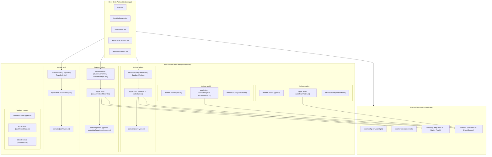

# Arquitectura del Sistema: MISINCOL PDM (Gobernanza 2026.4.0)

## Diagrama de Componentes y Rebanadas Verticales

```mermaid
graph TD
    subgraph UI_Shell ["Shell de la Aplicación (src/app)"]
        App["App.tsx"]
        AppWorkspace["AppWorkspace.tsx"]
        Header["AppHeader.tsx"]
        SidebarSection["AppSidebarSection.tsx"]
        MainContent["AppMainContent.tsx"]
    end

    subgraph Core ["Núcleo Compartido (src/core)"]
        Config["core/config (env.config.ts)"]
        Errors["core/errors (app.error.ts)"]
        Http["core/http (httpClient.ts - Native Fetch)"]
        Bus["core/bus (ServiceBus - Event Broker)"]
    end

    subgraph Vertical_Slices ["Rebanadas Verticales (src/features)"]
        subgraph Plans ["feature: plans"]
            PlansDomain["domain (plan.types.ts)"]
            PlansApp["application (usePlan.ts, calculations)"]
            PlansInfra["infrastructure (PhaseView, Sidebar, Modals)"]
        end

        subgraph Admin ["feature: admin"]
            AdminDomain["domain (admin.types.ts, colombiaDepartments.data.ts)"]
            AdminApp["application (useAdminDashboard.ts)"]
            AdminInfra["infrastructure (SuperAdminView, ColombiaMapCard)"]
        end

        subgraph Auth ["feature: auth"]
            AuthDomain["domain (auth.types.ts)"]
            AuthApp["application (authStorage.ts)"]
            AuthInfra["infrastructure (LoginView, TeamSelector)"]
        end

        subgraph Audit ["feature: audit"]
            AuditDomain["domain (audit.types.ts)"]
            AuditApp["application (auditStorage.ts, useTeamAudit.ts)"]
            AuditInfra["infrastructure (AuditModal)"]
        end

        subgraph Notes ["feature: notes"]
            NotesDomain["domain (notes.types.ts)"]
            NotesApp["application (useTeamNotes.ts)"]
            NotesInfra["infrastructure (NotesModal)"]
        end

        subgraph Reports ["feature: reports"]
            ReportsDomain["domain (report.types.ts)"]
            ReportsApp["application (useReportData.ts)"]
            ReportsInfra["infrastructure (ReportModal)"]
        end
    end

    UI_Shell --> PlansInfra
    UI_Shell --> AdminInfra
    UI_Shell --> AuthInfra
    UI_Shell --> Core

    PlansInfra --> PlansApp
    PlansApp --> PlansDomain

    AdminInfra --> AdminApp
    AdminApp --> AdminDomain

    AuthInfra --> AuthApp
    AuthApp --> AuthDomain

    PlansApp --> Bus
    AdminApp --> Bus
    AuditApp --> Bus
    NotesApp --> Bus

    PlansApp --> Http
    AdminApp --> Http
```
